# Brain Tumors & Computer Vision

**Detecting and delineating brain tumors in MRI with deep learning.** Two models: a
transfer-learned CNN that classifies tumor type from a single MRI slice at **98% test
accuracy**, and a 3D U-Net that labels tumor subregions voxel-by-voxel across a full MRI
volume at **~0.70 IOU**.

Graduate practicum project, Summer 2024 — Jonah Maroszek.

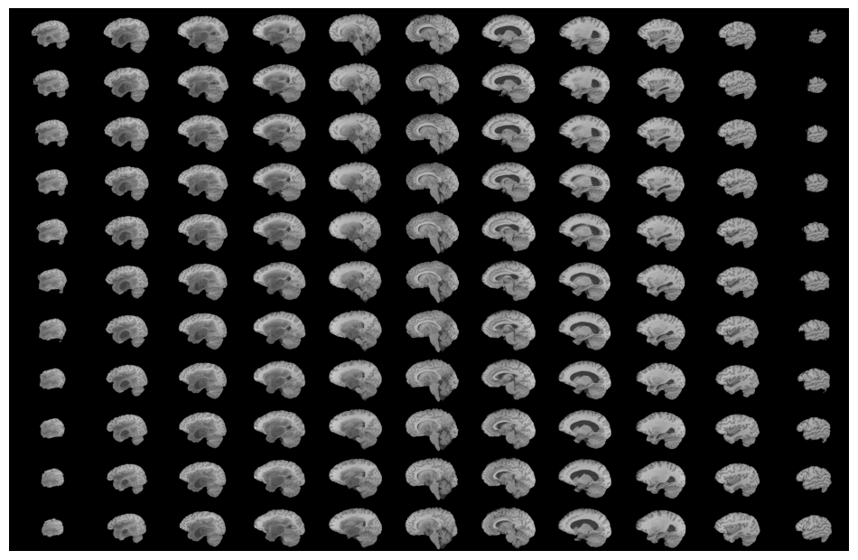

<sub>Every slice of one brain from this project. Can you see the tumor? Me neither — but my models can.</sub>

### 📄 **[Read the full report (18 pages, PDF)](Brain%20Tumors%20and%20Computer%20Vision.pdf)**

The report is the main document here: it covers the motivation, the methods, and the
results in depth. This README is the short version, plus a map of the code.

---

## At a glance

|  | Part 1 — Classification | Part 2 — Segmentation |
|---|---|---|
| **Task** | Which of 4 classes is this MRI slice? | Which voxels are tumor, and what kind? |
| **Data** | [Brain Tumor MRI Dataset](https://www.kaggle.com/datasets/masoudnickparvar/brain-tumor-mri-dataset) — 7,023 2D slices, 160 MB | [BraTS 2020](https://www.med.upenn.edu/cbica/brats2020/data.html) — 369 annotated 4-channel volumes, 40 GB |
| **Model** | Xception backbone (frozen, ImageNet) + custom head | 3D U-Net, 4 levels, trained from scratch |
| **Headline result** | **98%** accuracy; **1.00** recall on *no tumor* | **0.70** IOU; 0.98 precision / recall / F1 |
| **Key lever** | Adaptive learning rate (91% → 98%) | Custom Dice + Focal loss (0.60 → 0.70 IOU) |
| **Hardware** | Colab T4 | Colab L4 / A100 |
| **Notebook** | [`Xception.ipynb`](Xception.ipynb) | [`segmentation.ipynb`](segmentation.ipynb) |

[](https://colab.research.google.com/github/jmaroszek/brain_tumors/blob/main/Xception.ipynb)
[](https://colab.research.google.com/github/jmaroszek/brain_tumors/blob/main/segmentation.ipynb)

## Why this problem

Roughly **1 billion radiological scans** are performed each year, and 3–5% are
misdiagnosed — on the order of 30–50 million errors annually (Brady, 2016). The two
most common failure modes are missing a visible anomaly, and stopping the search after
finding the first one. Radiologists also disagree with *each other* on the same scan —
and, more surprisingly, with *themselves* on the same scan on different days
(Al-Khawari et al., 2010).

A model doesn't tire and returns the same answer every time it sees the same image.
That consistency is what makes it useful as a second reader, particularly where
specialist radiology is scarce. This project is a demonstration that the accuracy is
within reach.

## What's in this repo

| File | What it is |
|---|---|
| [`Brain Tumors and Computer Vision.pdf`](Brain%20Tumors%20and%20Computer%20Vision.pdf) | The full written report — motivation, methods, results, appendix, references. **Start here.** |
| [`Xception.ipynb`](Xception.ipynb) | Part 1. Data augmentation, transfer learning on Xception, training, and evaluation of the classifier. |
| [`segmentation.ipynb`](segmentation.ipynb) | Part 2. BraTS EDA, a custom `Sequence` data generator for `.nii` volumes, the 3D U-Net, the loss-function comparison, and evaluation. |
| [`assets/`](assets/) | Figures used in this README, taken from the notebooks and the report. |

> **A note on scope.** The report also covers a VGG16 baseline; that notebook is not in
> this repo, so the VGG16 numbers below are quoted from the report rather than
> reproducible from the code here. The two notebooks present are the ones behind the
> final results.

---

## Part 1 — Tumor classification

### The data

7,023 MRI slices (5,712 train / 1,311 test) in four balanced classes: **glioma**,
**meningioma**, **pituitary**, and **notumor**.

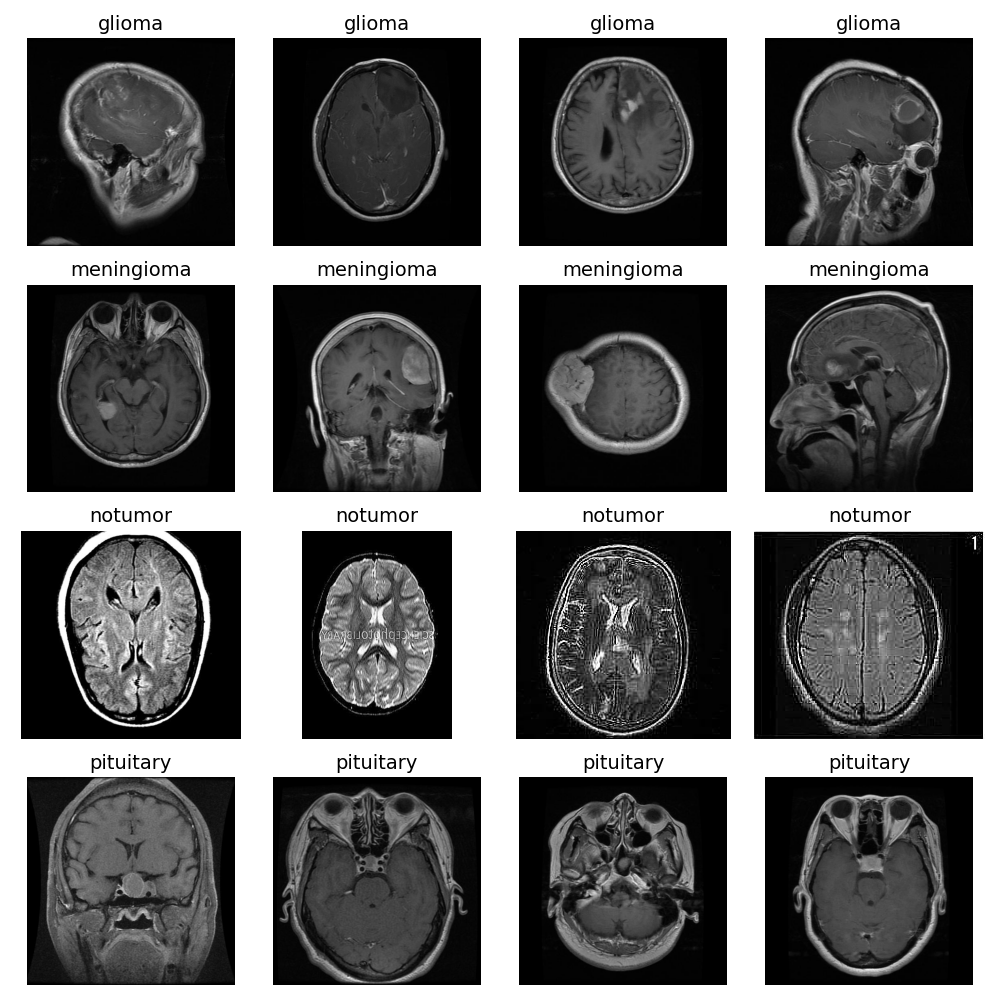

The scans are taken at different angles and cut through different cross-sections, so
surrounding anatomy varies a lot between images of the same class. Look at the
pituitary row: the paired black dots are eyes, not tumors. The model has to learn to
reject decoys like that from only 7k examples.

### Preprocessing

The training set is expanded with on-the-fly augmentation — rotation, width/height
shift, shear, zoom, horizontal flip — plus rescaling to `[0, 1]`. Images are resized to
299×299 to match Xception's native input. The test set gets rescaling only.

### The model

The ImageNet-pretrained Xception backbone is **frozen**, and a custom head is trained on
top of it:

```
Xception (frozen)  →  Conv2D 32  →  Conv2D 64  →  Conv2D 128
                   →  GlobalAveragePooling2D
                   →  Dense 512  →  Dropout 0.25
                   →  Dense 256  →  Dropout 0.25
                   →  Dense 4 (softmax)
```

21.7M total parameters, of which only **880,612 are trainable**. Adam at `1e-4`,
categorical cross-entropy.

<details>
<summary>Architecture diagram</summary>

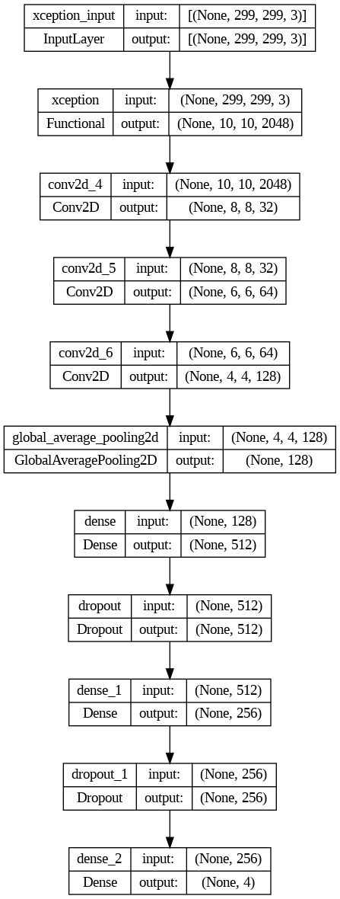

</details>

### Training strategy mattered more than architecture

Xception stalled around 91% — about the level of the VGG16 attempt — until I added
`ReduceLROnPlateau` (halve the learning rate after 5 epochs without validation
improvement). On the final run, validation loss dropped every time the learning rate
stepped down. Budgeted for 100 epochs; `EarlyStopping` (patience 10, best weights
restored) ended it at 52.

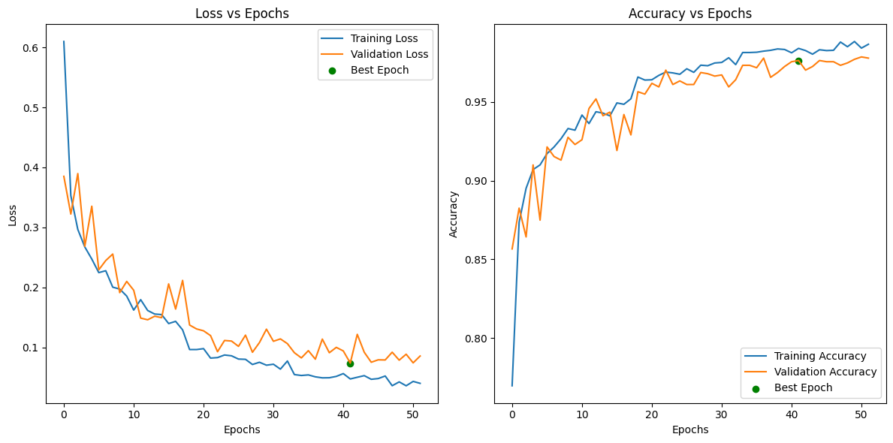

### Results

**98% test accuracy.** The confusion matrix shows where the remaining errors live:

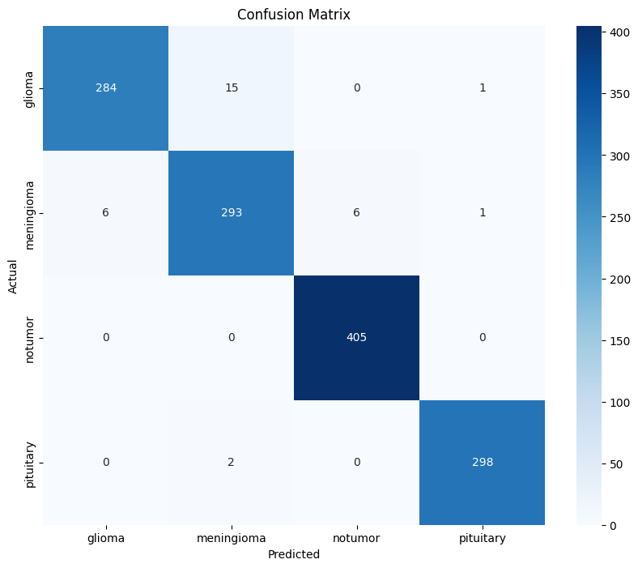

There are 31 errors in 1,311 test images, and the largest single mode is glioma
predicted as meningioma — 15 cases, about half of all mistakes. The clinically important
cell is the *notumor* row: **405/405, perfect recall**. The model never told a patient
with a tumor that they were healthy.

Against the VGG16 baseline from the report:

| Class | Metric | **Xception** | VGG16 |
|---|---|---|---|
| Glioma | Precision | **0.98** | 0.97 |
| | Recall | **0.95** | 0.77 |
| | F1 | **0.96** | 0.86 |
| Meningioma | Precision | **0.95** | 0.82 |
| | Recall | **0.96** | 0.77 |
| | F1 | **0.95** | 0.79 |
| No tumor | Precision | **0.99** | 0.93 |
| | Recall | **1.00** | 0.98 |
| | F1 | **0.99** | 0.96 |
| Pituitary | Precision | **0.99** | 0.83 |
| | Recall | **0.99** | 0.99 |
| | F1 | **0.99** | 0.90 |
| **Overall** | **Accuracy** | **0.98** | 0.89 |

Xception wins on every metric, converges faster, and uses roughly 5× fewer parameters.
Worth stating plainly: this is not a controlled architecture comparison. I built the
VGG16 model first and the Xception model second, with different heads and more
experience by the time I got to the second one.

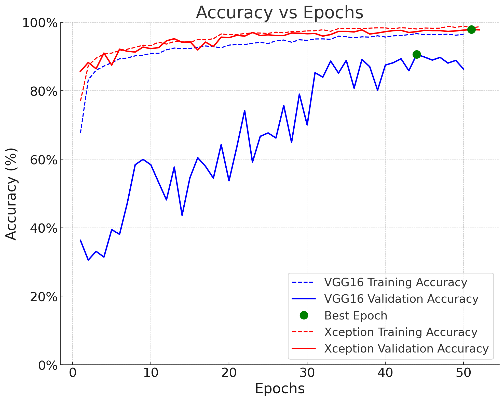

---

## Part 2 — Tumor segmentation

Classification has two real limitations. It won't tell you *which part* of the image
drove the diagnosis, and the dataset above consists of single 2D slices that a
radiologist had already picked out as diagnostically relevant. A useful system should
take everything the MRI machine produces and point at the problem itself.

### The data

[BraTS 2020](https://www.med.upenn.edu/cbica/brats2020/data.html): 369 annotated cases,
40 GB. The size doesn't come from more patients — it comes from dimensionality. Each
case is a full 240×240×155 volume in four co-registered MRI sequences, plus a
radiologist-drawn segmentation mask that was vetted by other radiologists.

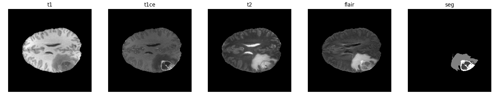

T1, T1 post-contrast, T2, and T2-FLAIR each highlight different tissue properties. The
`seg` mask is the label: healthy tissue versus tumor subregions (edema, necrotic core,
enhancing tumor). Every tumor in this dataset is a glioma, so the classes describe
*parts of the tumor* rather than tumor types.

### Preprocessing

`.nii` volumes are far too large to load into memory at once, so `MRIDataGenerator`
(a `keras.utils.Sequence`) streams them:

- Loads `.nii` with `nibabel`, converts to NumPy
- Crops `[56:-56, 56:-56, 13:-14]` → a **128×128×128** interior volume, dropping mostly-empty border
- Min-max scales each channel to `[0, 1]`
- Stacks **T1ce + T2 + FLAIR** into `X` of shape `(batch, 128, 128, 128, 3)` — plain T1 is dropped as largely redundant with T1ce, which saves a quarter of the compute
- Remaps mask label `4 → 3` and one-hot encodes to `y` of shape `(batch, 128, 128, 128, 4)`

BraTS ships a separate validation folder, but it has **no ground-truth masks** — it's
for challenge submission. To be able to compute IOU at all, I split 20% off the training
folder as my validation set instead.

### The model

A 3D U-Net: an encoder that halves the spatial dimensions four times (16 → 32 → 64 →
128 → 256 filters), a symmetric decoder that upsamples back with `Conv3DTranspose`, and
skip connections between matching levels to preserve fine spatial detail that pooling
throws away. Output is a per-voxel softmax over 4 classes.

The architecture is adapted from
[Sreenivas Bhattiprolu's `simple_3d_unet.py`](https://github.com/bnsreenu/python_for_microscopists/blob/master/231_234_BraTa2020_Unet_segmentation/simple_3d_unet.py),
credited in the notebook.

<details>
<summary>Full layer diagram (very tall)</summary>

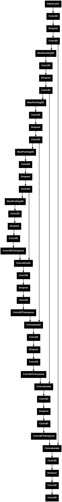

</details>

### The loss function was the biggest lever

Most brain tissue is healthy even in patients with aggressive tumors, so the voxel
classes are severely imbalanced — and plain cross-entropy is happy to do well by
predicting "healthy" nearly everywhere. Two losses address this directly:

- **Dice loss**, built on the Dice coefficient, is designed for imbalanced segmentation
- **Focal loss** down-weights already-easy voxels so training concentrates on hard ones

I trained with the sum of the two and compared against cross-entropy:

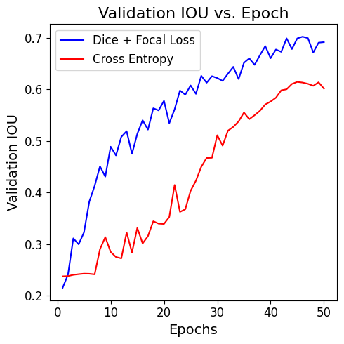

**0.70 vs 0.60 validation IOU** over 50 epochs — a bigger gain than anything else I
changed. (Caveat from the report: the Dice+Focal run used batch size 16 on an A100 and
the cross-entropy run used batch size 8 on an L4, because that's the hardware I could
get. Everything else was held constant.)

### Knowing when to stop

Both curves were still climbing at epoch 50 and I was running out of compute credits.
Rather than guess, I fit an exponential to the validation loss and extrapolated:

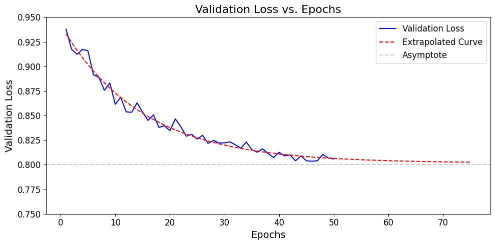

The curve was already within ~0.01 of its fitted asymptote. Another 25 epochs would have
bought almost nothing. I didn't buy more credits.

### Results

**IOU 0.70**, with precision, recall, and F1 all at **0.98**. (Accuracy is reported too,
but it's not very meaningful for segmentation — the class imbalance inflates it, which
is why IOU is the number to look at.)

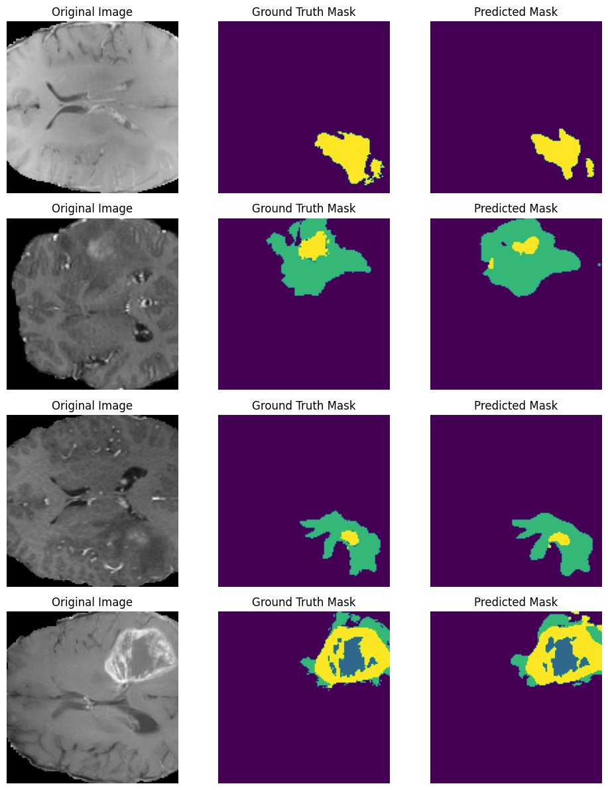

Four consecutive samples from the test generator — original slice, radiologist's
ground-truth mask, model prediction. In the first row I can't see the tumor even knowing
it's there. The predicted masks aren't perfect, but they line up well with the
radiologist's, and they're comfortably good enough to counteract the two most common
human failure modes: missing an anomaly, and missing the *second* anomaly.

---

## Limitations & what I'd do next

Stated plainly, because they matter for how much weight these numbers should carry:

- **The classification and segmentation datasets are unrelated.** The two models are not
  a pipeline; they're two answers to two framings of the problem.
- **No external validation.** Both models are evaluated on held-out data from the same
  source as their training data. Real deployment performance across scanners, sites,
  and protocols would be lower.
- **The classification test set doubles as the validation set** in the notebook, so 98%
  is optimistic — early stopping selected on the same data it's reported on.
- **VGG16 vs Xception isn't a controlled comparison** (different heads, different points
  on my own learning curve).
- **Segmentation was compute-bound**, not idea-bound. 50 epochs, one architecture, one
  fold, no hyperparameter search.
- **Next steps I'd actually take:** unfreeze the top Xception blocks and fine-tune at a
  low learning rate; report per-subregion Dice (whole tumor / core / enhancing) so the
  results are comparable to the BraTS leaderboard; cross-validate; and add Grad-CAM to
  the classifier so it can point at what it saw.

An earlier plan for this project was to compare the CNNs against
[AnomalyGPT](https://github.com/CASIA-IVA-Lab/AnomalyGPT), an LLM-integrated anomaly
detection and segmentation system. I reproduced its published results on its own
datasets (see the report appendix) but couldn't adapt it to brain MRI in the time
available, and refocused on the CNN work with my advisor's approval.

## Running the code

Both notebooks were written and run in **Google Colab** with a GPU runtime, reading
data from Google Drive. They are research notebooks, not a packaged pipeline — to run
them you'll need to download the datasets yourself and repoint the path variables
(`root_directory` in `Xception.ipynb`, `root_dir` in `segmentation.ipynb`) at your own
Drive folders.

**Requirements:** `tensorflow` / `keras`, `scikit-learn`, `numpy`, `pandas`,
`matplotlib`, `seaborn`, `pillow`, plus `nibabel`, `scikit-image`, `scipy`, and
[`segmentation_models_3D`](https://github.com/ZFTurbo/segmentation_models_3D) for the
segmentation notebook. Colab provides everything except the last, which the notebook
pip-installs.

**Hardware:** the classifier trains on a T4 in a few minutes per epoch. The 3D U-Net is
memory-hungry — batch size 8 on 128³×3 volumes peaks around 38 GB of system RAM, so an
A100 runtime is what makes batch size 16 possible.

## References

- Al-Khawari, H., Athyal, R., & Sada, P. (2010). [Inter- and intraobserver variation between radiologists in the detection of abnormal parenchymal lung changes on high-resolution computed tomography](https://www.ncbi.nlm.nih.gov/pmc/articles/PMC2855063/).
- Bakas, S., Akbari, H., Sotiras, A., Bilello, M., Rozycki, M., Kirby, J. S., et al. (2017). Advancing The Cancer Genome Atlas glioma MRI collections with expert segmentation labels and radiomic features. *Nature Scientific Data*, 4, 170117. [doi:10.1038/sdata.2017.117](https://doi.org/10.1038/sdata.2017.117)
- Bakas, S., Reyes, M., Jakab, A., Bauer, S., Rempfler, M., Crimi, A., et al. (2018). [Identifying the Best Machine Learning Algorithms for Brain Tumor Segmentation, Progression Assessment, and Overall Survival Prediction in the BRATS Challenge](https://arxiv.org/abs/1811.02629). *arXiv:1811.02629*.
- Brady, A. P. (2016). [Error and discrepancy in radiology: Inevitable or avoidable?](https://www.ncbi.nlm.nih.gov/pmc/articles/PMC5265198/)
- Gao, H., & Jiang, X. (2013). [Progress on the diagnosis and evaluation of brain tumors](https://www.ncbi.nlm.nih.gov/pmc/articles/PMC3864167/).
- Menze, B. H., Jakab, A., Bauer, S., Kalpathy-Cramer, J., Farahani, K., Kirby, J., et al. (2015). The Multimodal Brain Tumor Image Segmentation Benchmark (BRATS). *IEEE Transactions on Medical Imaging*, 34(10), 1993–2024. [doi:10.1109/TMI.2014.2377694](https://doi.org/10.1109/TMI.2014.2377694)

---

<sub>The report opens with the personal reason I took this on. If you only read one part
of it, read that one.</sub>
